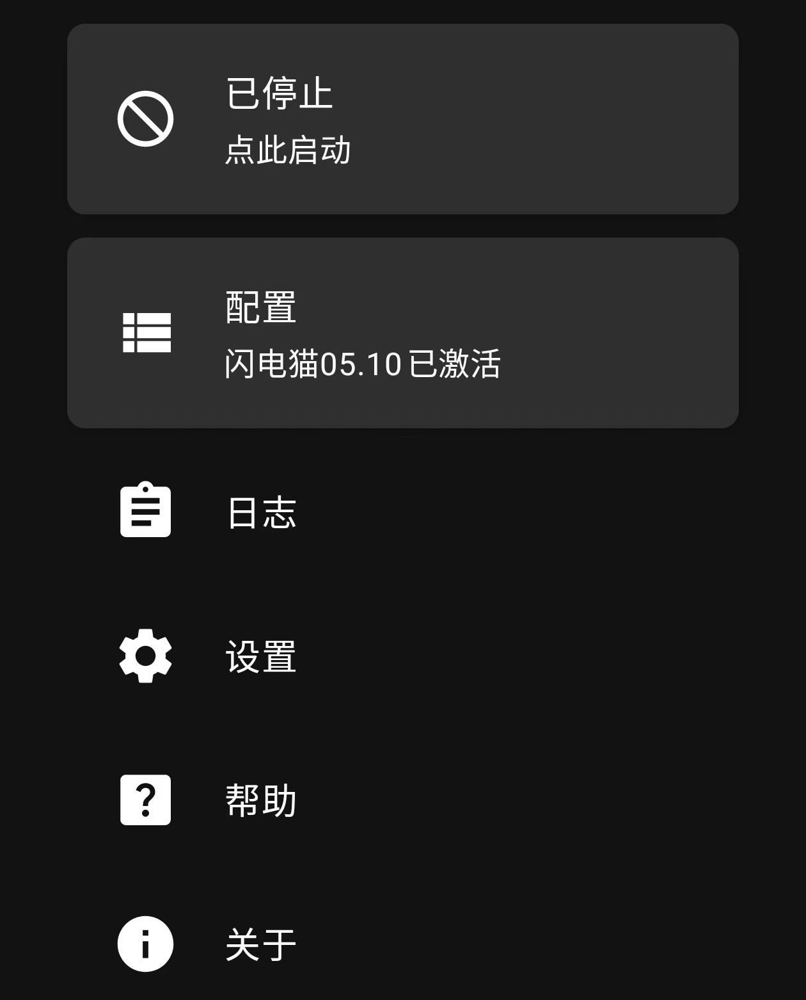
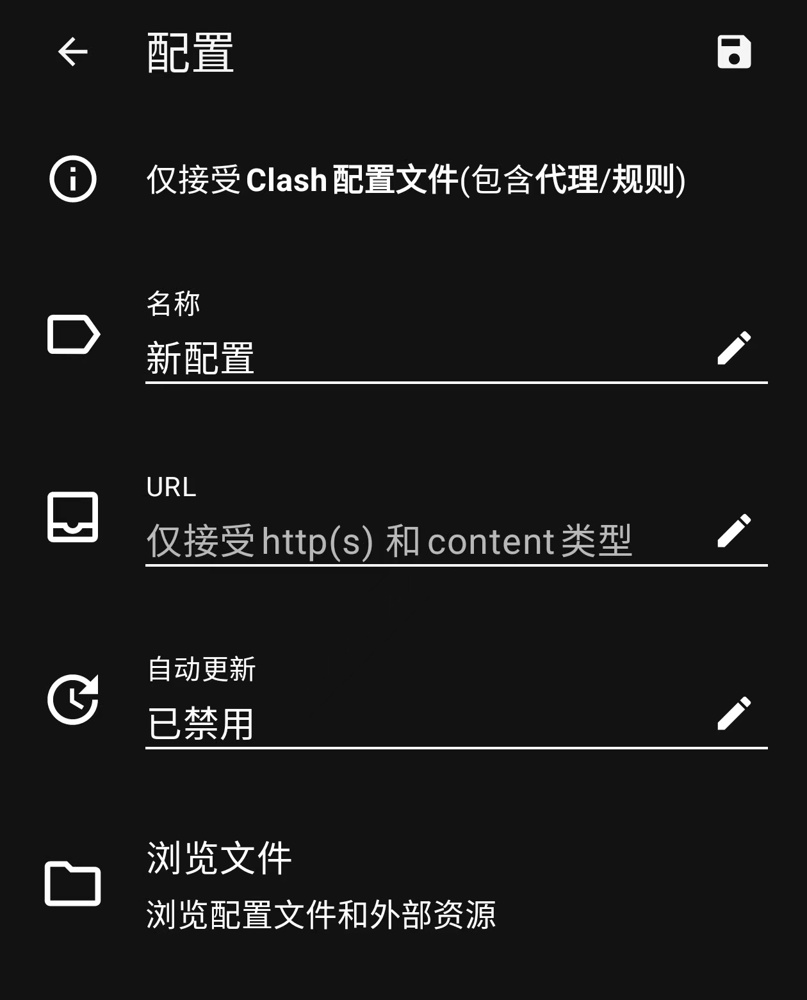

## 为什么要使用低价VPN
在这个中文互联网逐渐被同质化和廉价低质量内容充斥，几乎所有的实用资源都需要VIP，浪费我们的时间和金钱，例如百度系列产品，你手机的自带浏览器，几乎都充满了令人作呕的低俗广告和自己的会员制产品，想要找到自己心仪的资料或者资源难上加难，因此我们只能更换环境，至少是我的信息来源，所以我们选择了低价VPN。

### 安卓手机使用教程
你需要准备的
- 一部安卓11及以上的手机 （以保证兼容性）
- 一个能正常链接国内互联网的环境
- 一个脑子

#### 实际操作
第一步，下载ClashVPN，[**_点击下载_**](https://down.clashcn.com/soft/clashcn.com_cmfa-2.11.7-meta-universal-release.apk)
- Clash其实本身并不提供翻墙服务，他只相当于一个梯子旁边的两根提供框架的棍子，你的翻墙服务任然需要另外寻找或者购买。
第二步，打开Clash for Android，然后你将看到如下界面，
当然我激活了一个闪电猫的配置，如果你是第一次进入应该没这个什么闪电猫，所以你点击配置，点击右上角加号，然后从URL导入，接下来你将看到如下界面，

你需要将你获得的url复制放到中间的url当中，然后你可以改该配置的名称点击右上角保存，之后回到第一步的界面，点击激活即可，但是请注意，激活之前你需要再次点击配置然后选择你新增加的配置。

##### 我的想法
免费VPN这个东西是极其不稳定的，但是如果是低价VPN就相对来说好一点，由于本人的能力限制，我没有条件自己购买服务器搭建VPN，并且这个消耗非常的大，由于凡事都有不确定，所以我们需要准备的并非一个配置，而是至少两个及以上，因此，我们需要准备的是一个紧急联络用的超级低价VPN，一个价格略高但是体验更好的VPN，所以我推荐[**_一元机场_**](https://xn--4gq62f.org/)作为应急联络,将[**_SPEEDCAT_**](https://www.speedcat.ws/)作为高体验

> “在信息的高速公路上，VPN就是你的隐形斗篷。” 

